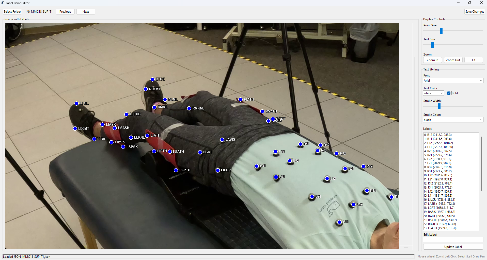

# Label Point Editor

A GUI application for viewing and editing label points in images with corresponding JSON files.



## Features

- **Folder Loading**: Select a folder containing image and JSON file pairs
- **Image Display**: View images with overlaid label points and text
- **Interactive Selection**: Click on points to select them or use the label list
- **Label Editing**: Edit label names while preserving point locations
- **Advanced Zoom**: 
  - Mouse wheel zoom with cursor-centered zooming
  - Zoom in/out buttons and fit-to-canvas option
  - Zoom range: 0.1x to 10x
- **Pan & Navigate**: 
  - Drag with left mouse button to pan around zoomed images
  - Smart click detection (distinguishes clicks from drags)
- **Text Styling Controls**:
  - Multiple font families (Arial, Times New Roman, Courier New, Helvetica, Verdana)
  - Text colors (Black, White, Red, Blue, Green, Yellow, Orange, Purple)
  - Bold text option
  - Text stroke/outline (0-5 pixels width) for better visibility
- **Customizable Display**: 
  - Adjust point size (3-20 pixels)
  - Adjust text size (8-48 pixels)
- **Navigation**: Browse through multiple image-JSON pairs with Previous/Next
- **Save Changes**: Save modifications back to JSON files
- **Status Updates**: Real-time feedback on operations and zoom levels

## Requirements

- Python 3.6 or higher
- Pillow (PIL) library for image handling
- tkinter (usually included with Python)

## Installation

1. Install required packages:
   ```
   pip install -r requirements.txt
   ```

## Usage

### Running the Application

**Option 1: Using Python directly**
```
python label_editor.py
```

**Option 2: Using the batch file (Windows)**
```
run_label_editor.bat
```

### Using the Interface

1. **Select Folder**: Click "Select Folder" and choose a directory containing image and JSON files with matching names (e.g., `image1.png` and `image1.json`)

2. **Navigate Files**: Use "Previous" and "Next" buttons to browse through image-JSON pairs

3. **Adjust Display**: Use the controls to customize:
   - **Point Size**: Size of the circular points (3-20 pixels)
   - **Text Size**: Size of the label text (8-48 pixels)
   - **Font Family**: Choose from Arial, Times New Roman, Courier New, Helvetica, Verdana
   - **Text Color**: Select from 8 different colors
   - **Bold Text**: Make text bold for better visibility
   - **Text Stroke**: Add outline to text (0-5 pixels) with customizable stroke color

4. **Zoom and Pan**:
   - **Mouse Wheel**: Scroll to zoom in/out (zooms where your cursor points)
   - **Zoom Buttons**: Use Zoom In, Zoom Out, and Fit buttons
   - **Pan**: Click and drag with left mouse button to move around when zoomed
   - **Zoom Range**: 0.1x to 10x magnification

5. **Select Points**: 
   - Click directly on points in the image, or
   - Select from the label list on the right
   - Smart click detection prevents accidental selection while panning

6. **Edit Labels**:
   - Select a point
   - Modify the text in the "Edit Label" field
   - Click "Update Label" to apply changes

7. **Save Changes**: Click "Save Changes" to write modifications to the JSON file

### JSON Format

The application expects JSON files with the following structure:
```json
{
  "shapes": [
    {
      "label": "POINT_NAME",
      "points": [[x, y]],
      "shape_type": "point"
    }
  ]
}
```

## Color Coding

- **Blue points**: Unselected points with white outline
- **Red points**: Currently selected point
- **Customizable text colors**: Choose from 8 colors (default: black for unselected)
- **Red text**: Currently selected label (overrides color setting)
- **Text stroke**: Customizable outline color for better visibility against backgrounds

## Tips

- **Mouse wheel zoom**: Point your mouse where you want to zoom and scroll
- **Panning**: Click and drag to move around when zoomed in
- **Text visibility**: Use stroke/outline feature when labels are hard to read against busy backgrounds
- **Font selection**: Different fonts may render better at different sizes
- **Smart interaction**: The app distinguishes between clicks (point selection) and drags (panning)
- **Zoom status**: Current zoom level is displayed in the status bar
- **High contrast**: Use white stroke on dark text or dark stroke on light text for maximum visibility
- Selected points are highlighted in red for easy identification
- Changes are only saved when you click "Save Changes"
- The status bar shows current operations, zoom level, and file information

## Troubleshooting

- Ensure image and JSON files have matching base names
- Check that JSON files follow the expected format
- Verify that the Pillow library is installed for image support
- If fonts don't display correctly, the app will fall back to default system fonts
- For dense label areas, use zoom and text stroke features for better visibility
- If panning seems stuck, try clicking "Fit" to reset the view
- Mouse wheel zoom works best with a smooth-scrolling mouse
